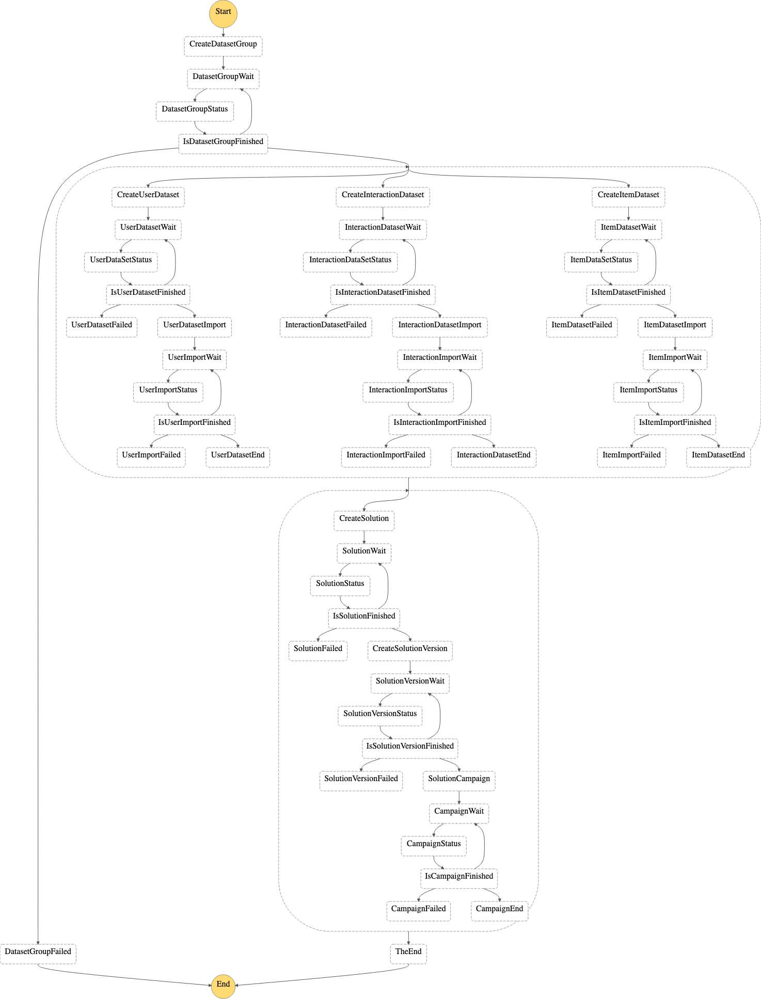

# Amazon Personalize Campaign Creator using the Cars Dataset

This repo uses the dataset from the [Personalize-car-search repo](https://github.com/markproy/personalize-car-search) to create a Amazon Personalize Campaign to be used in the [Predictive User Engagement AWS Solution](https://aws.amazon.com/blogs/messaging-and-targeting/predictive-user-engagement-using-amazon-pinpoint-and-amazon-personalize/).  This repo contains an [AWS CloudFormation](https://aws.amazon.com/cloudformation/) template that will setup a [AWS Step Functions](https://aws.amazon.com/step-functions/) State Machine, multiple [AWS Lambda](https://aws.amazon.com/lambda/) functions, the necessary IAM roles, and S3 buckets necessary to create a fully functioning [Amazon Personalize](https://aws.amazon.com/personalize/) Campaign.

## State Machine

## Deploy
1. Download the [Template](https://raw.githubusercontent.com/Ryanjlowe/Personalize-car-campaign/master/template.yml) into CloudFormation.

2. Manually execute the Step Functions State Machine.  This will take a little over an hour to execute and run.
